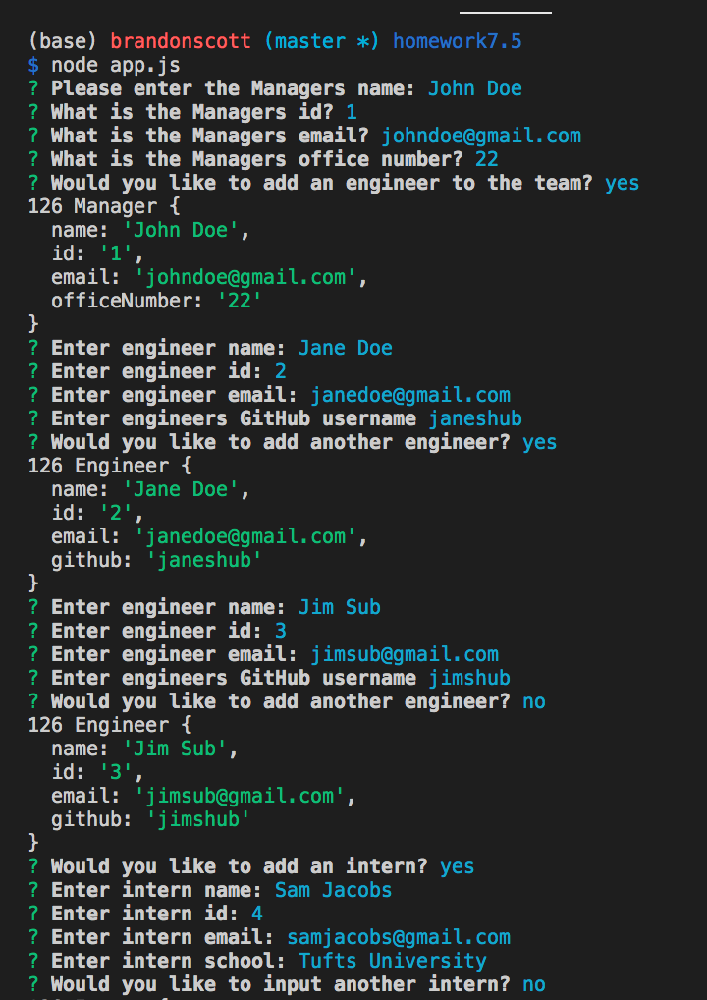
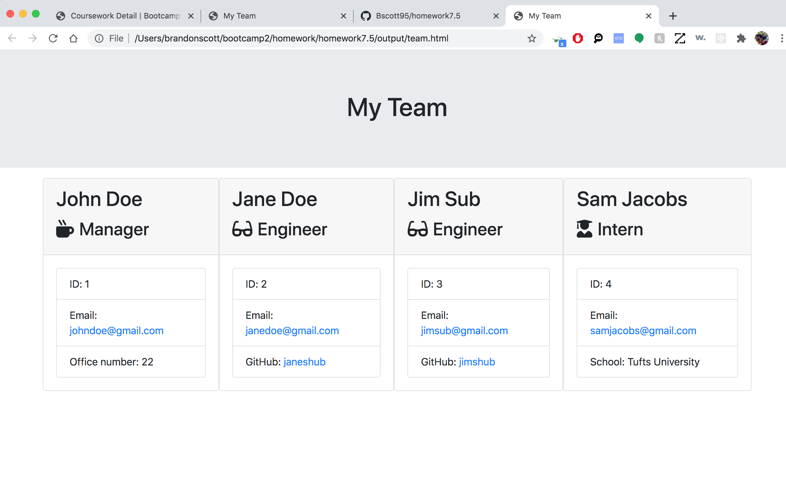

# Template Engine - Employee Summary

One of the most important aspects of programming is writing code that is readable, reliable, and maintainable. Oftentimes, *how* we design our code is just as important as the code itself. Here, I build a Node CLI that takes in information about employees and generates an HTML webpage that displays summaries for each person. Since testing is a key piece in making code maintainable, I ensured it will pass all unit tests.

This app builds a software engineering team generator command line application. The application will prompt the user for information about the team manager and then information about the team members. The user can input any number of team members, and they may be a mix of engineers and interns. This assignment must also pass all unit tests. When the user has completed building the team, the application will create an HTML file that displays a nicely formatted team roster based on the information provided by the user. The basic use case is as follows:

```
As a manager
I want to generate a webpage that displays my team's basic info
so that I have quick access to emails and GitHub profiles
```

## Links

Github repo: https://github.com/Bscott95/homework7.5

Screenshots:




